# FTDI Development Board - FT260S and FT312D #

<p align="center">
  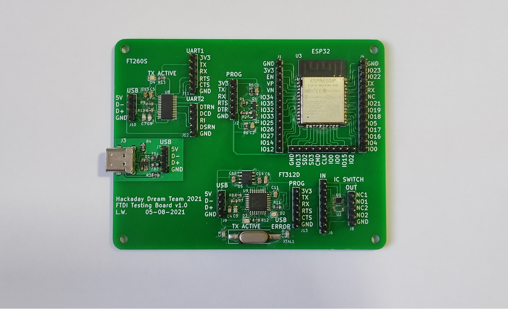
</p>

This repository contains the design of a development board for the [FT260S](https://www.digikey.com/en/products/detail/ftdi-future-technology-devices-international-ltd/FT260S-U/6124909) and the [FT312D](https://www.digikey.com/en/products/detail/ftdi-future-technology-devices-international-ltd/FT312D-32L1C-R/4047486). The PCB was designed using KiCad.

## Hardware Design

The design includes the following circuits:

### USB C Port and Electromagnetic Compatibility (EMC)

Everything starts with the USB C port, this type of USB was selected because it's size and because of the growing trend of using this port to charge and communicate with portable devices.

The design includes [Transient Voltage Suppression (TVS) diodes](https://www.digikey.com/en/products/detail/comchip-technology/CPDT6-5V4-HF/1121118) and [Ferrite Beads](https://www.digikey.com/en/products/detail/fair-rite-products-corp/2508056017Y0/8594301) to reduce the Electromagnetic Interference (EMI). These [protections for the USB](https://www.rs-online.com/designspark/usb-port-protection) port will add compliance with the [EMC regulations and standards](https://learnemc.com/emc-regulations-and-standards) from the  Federal Communications Commission (FCC) and the European Union.

<p align="center">
  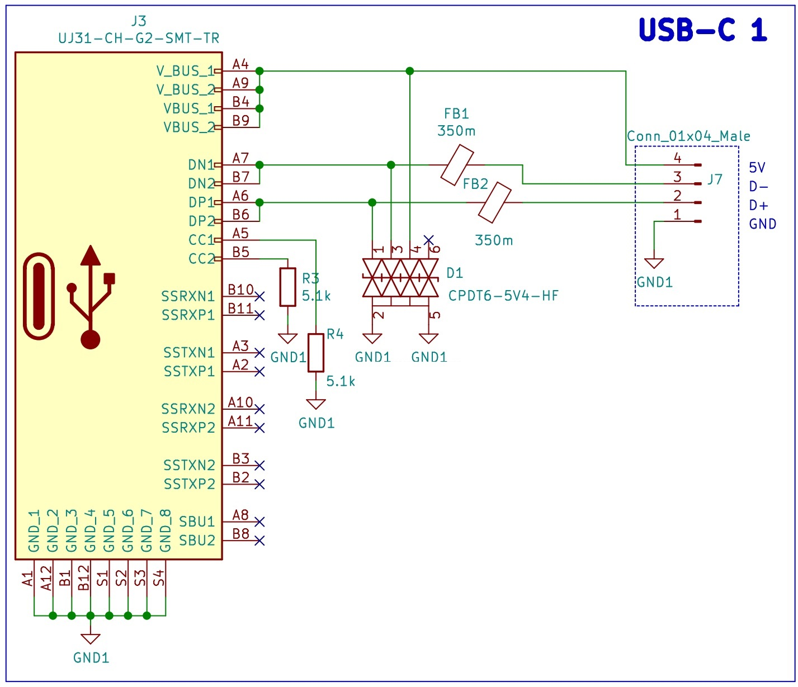
</p>

### FTDI 1: FT260S-U

The first USB TO UART/I2C FTDI that we is being tested is the [FT260S-U](https://www.digikey.com/en/products/detail/ftdi-future-technology-devices-international-ltd/FT260S-U/6124909). The design only considers the USB to UART, therefore the I2C is left unconnected.

<p align="center">
  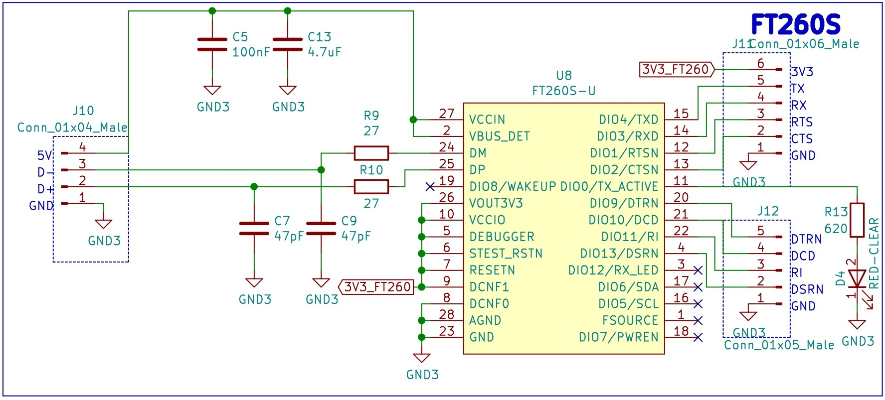
</p>

### FTDI 2: FT312D-32L1C-R

The second USB TO UART/I2C FTDI that is being tested is the [FT312D-32L1C-R](https://www.digikey.com/en/products/detail/ftdi-future-technology-devices-international-ltd/FT312D-32L1C-R/4047486). This IC does not support DTR/DSR for the UART, a feature that is required for the auto reset circuit of the [ESP32](https://www.digikey.com/en/products/detail/espressif-systems/ESP32-WROOM-32D-4MB/9381716) that was implemented, nevertheless the PCB has it as a second alternative.

<p align="center">
  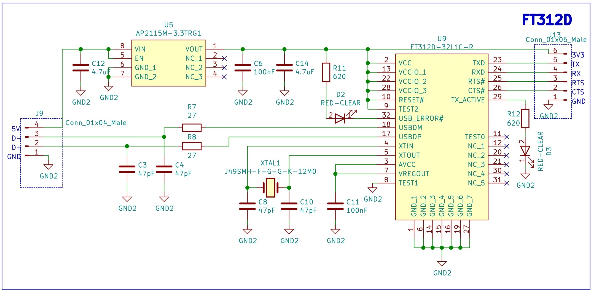
</p>

### ESP32 with Auto Reset

Finally, the [ESP32](https://www.digikey.com/en/products/detail/espressif-systems/ESP32-WROOM-32D-4MB/9381716). The design includes an auto reset circuit that uses RTS and DTR to reset and put in bootloader mode the ESP32. For more information about this circuit, these blogs [1](https://forum.micropython.org/viewtopic.php?f=18&t=4966) [2](https://forums.adafruit.com/viewtopic.php?f=57&p=483993#p487891) can be useful.

<p align="center">
  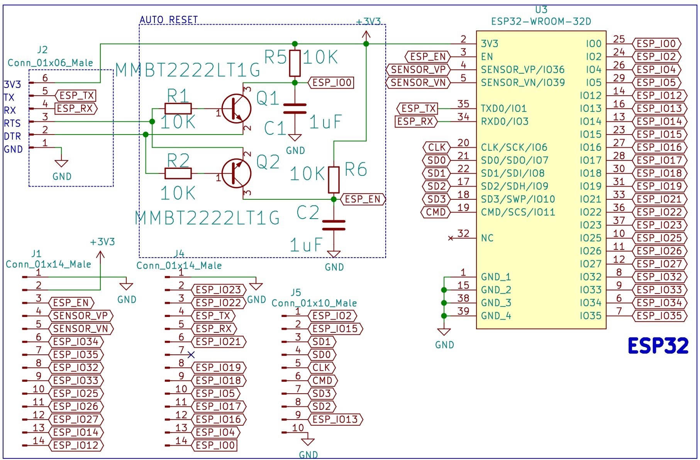
</p>

### SPDT Switch

The design includes a couple of [TS5A3153DCUR](https://www.digikey.com/en/products/detail/texas-instruments/TS5A3153DCUR/1216791) that will be tested for future implementations.

<p align="center">
  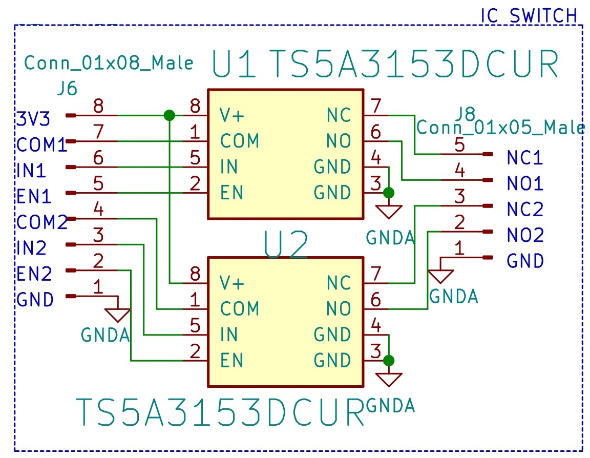
</p>

## Bill of Materials ##

| Reference | Quantity |
| ------------- | ------------- |
| [1 µF ±10% 10V Ceramic Capacitor X7R 0805 (2012 Metric)](https://www.digikey.com/en/products/detail/samsung-electro-mechanics/CL21B105KPFNNNE/3886933)  | 2 |
| [47 pF ±5% 16V Ceramic Capacitor C0G, NP0 0805 (2012 Metric)](https://www.digikey.com/en/products/detail/w%C3%BCrth-elektronik/885012007014/5453673)  | 6 |
| [0.1 µF ±10% 50V Ceramic Capacitor X7R 0805 (2012 Metric)](https://www.digikey.com/en/products/detail/avx-corporation/08055C104KAT2A/563505)  | 3 |
| [4.7 µF ±10% 6.3V Ceramic Capacitor X5R 0805 (2012 Metric)](https://www.digikey.com/en/products/detail/samsung-electro-mechanics/CL21A475KQFNNNE/3886856)  | 3 |
| [15V Clamp 5A (8/20µs) Ipp Tvs Diode Surface Mount SOT-23-6](https://www.digikey.com/en/products/detail/comchip-technology/CPDT6-5V4-HF/1121118)  | 1 |
| [Red 630nm LED Indication - Discrete 1.9V 0805 (2012 Metric)](https://www.digikey.com/en/products/detail/w%C3%BCrth-elektronik/150080SS75000/4489921)  | 3 |
| [1 Signal Line Ferrite Bead 0805 (2012 Metric) 300mA 350mOhm](https://www.digikey.com/en/products/detail/fair-rite-products-corp/2508056017Y0/8594301)  | 2 |
| [USB-C (USB TYPE-C) USB 3.2 Gen 2 (USB 3.1 Gen 2, Superspeed + (USB 3.1)) Receptacle Connector 24 Position Board Cutout, Surface Mount, Right Angle; Through Hole](https://www.digikey.com/en/products/detail/cui-devices/UJ31-CH-G2-SMT-TR/8024057)  | 1 |
| [Bipolar (BJT) Transistor NPN 30 V 600 mA 250MHz 300 mW Surface Mount SOT-23-3 (TO-236)](https://www.digikey.com/en/products/detail/onsemi/MMBT2222LT1G/919595)  | 2 |
| [10 kOhms ±1% 0.125W, 1/8W Chip Resistor 0805 (2012 Metric)](https://www.digikey.com/en/products/detail/vishay-dale/CRCW080510K0FKEAC/7928398)  | 4 |
| [5.1 kOhms ±1% 0.125W, 1/8W Chip Resistor 0805 (2012 Metric)](https://www.digikey.com/en/products/detail/stackpole-electronics-inc/RMCF0805FT5K10/1760394)  | 2 |
| [27 Ohms ±1% 0.125W, 1/8W Chip Resistor 0805 (2012 Metric)](https://www.digikey.com/en/products/detail/stackpole-electronics-inc/RMCF0805FT27R0/1712920)  | 4 |
| [620 Ohms ±5% 0.125W, 1/8W Chip Resistor 0805 (2012 Metric)](https://www.digikey.com/en/products/detail/yageo/RC0805JR-07620RL/728357)  | 3 |
| [1 Circuit IC Switch 2:1 900mOhm 8-VSSOP](https://www.digikey.com/en/products/detail/texas-instruments/TS5A3153DCUR/1216791)  | 2 |
| [ESP32-WROOM-32D (4MB)](https://www.digikey.com/en/products/detail/espressif-systems/ESP32-WROOM-32D-4MB/9381716)  | 1 |
| [IC REG LINEAR 3.3V 1A 8SOIC](https://www.digikey.com/en/products/detail/diodes-incorporated/AP2115M-3-3TRG1/5305574)  | 1 |
| [FT260S-U IC USB TO UART/I2C 28-TSSOP](https://www.digikey.com/en/products/detail/ftdi-future-technology-devices-international-ltd/FT260S-U/6124909)  | 1 |
| [FT312D-32L1C-R IC USB HOST CTRL 32-LQFP](https://www.digikey.com/en/products/detail/ftdi-future-technology-devices-international-ltd/FT312D-32L1C-R/4047486)  | 1 |
| [12 MHz ±30ppm Crystal 18pF 35 Ohms HC-49/US](https://www.digikey.com/en/products/detail/jauch-quartz/J49SMH-F-G-G-K-12M0/10416018)  | 1 |
| [Conn Header 40POS 2.54](https://www.digikey.com/en/products/detail/3m/2340-6111TG/1237275)  | 3 |

## PCB

<p align="center">
  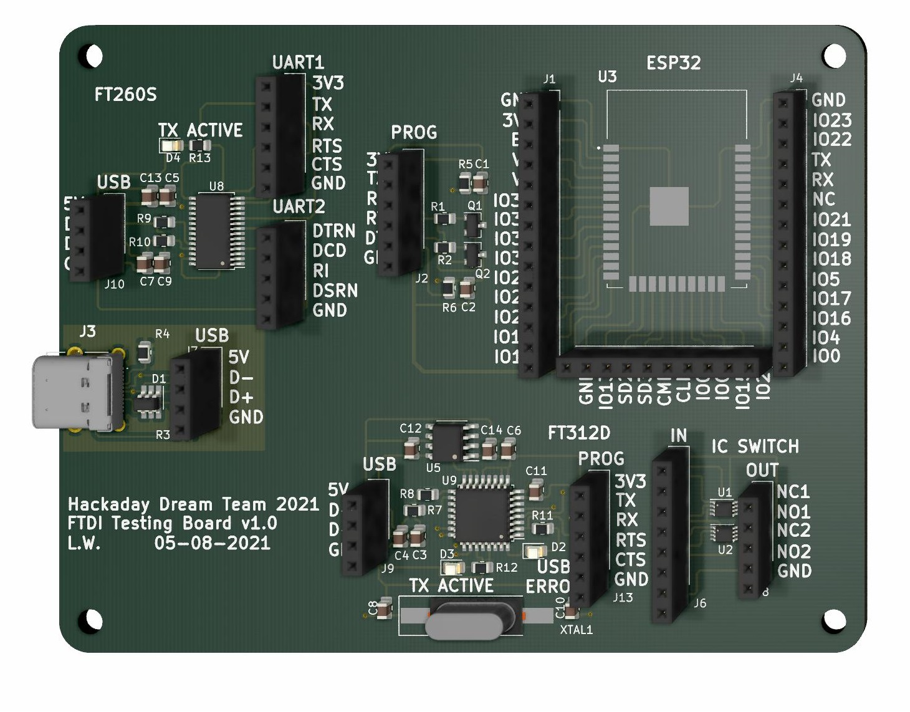
</p>

<p align="center">
  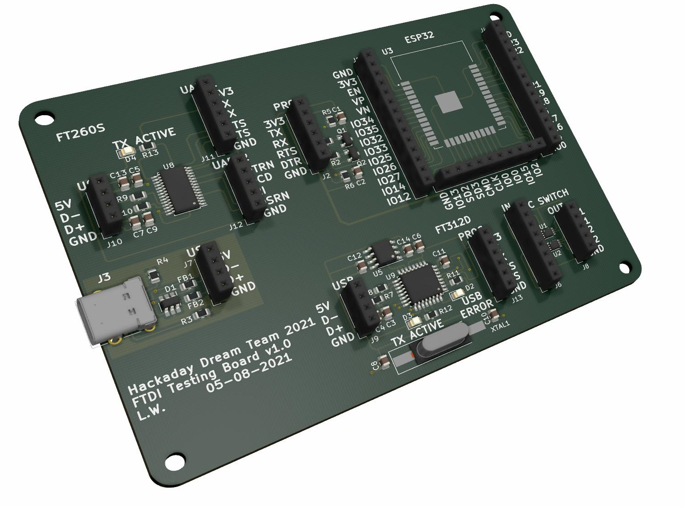
</p>

## TESTING

### ESP32 with Auto Reset

The designed auto reset circuit requires the signals 3.3V, GND, TX, RX, RTS and DTR. To test the circuit we used a commercial [USB to Serial Converter](https://www.amazon.com/gp/product/B075N82CDL/ref=ppx_yo_dt_b_asin_title_o04_s00?ie=UTF8&language=en_US&psc=1) that contains the FT232RL, and provides all the required signal.

<p align="center">
  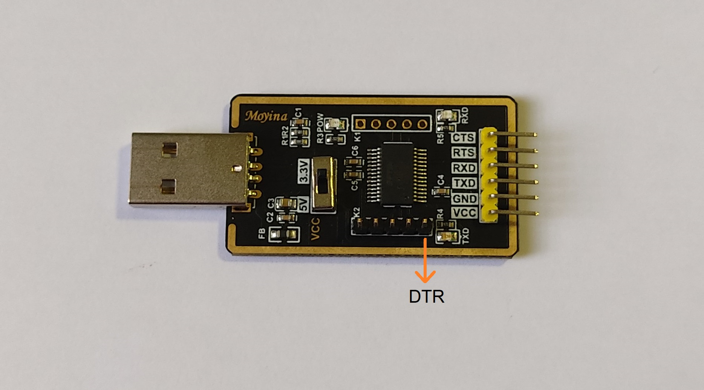
</p>

The following wiring diagram shows how to connect the commercial [USB to Serial Converter](https://www.amazon.com/gp/product/B075N82CDL/ref=ppx_yo_dt_b_asin_title_o04_s00?ie=UTF8&language=en_US&psc=1) and our FTDI Development Board.

<p align="center">
  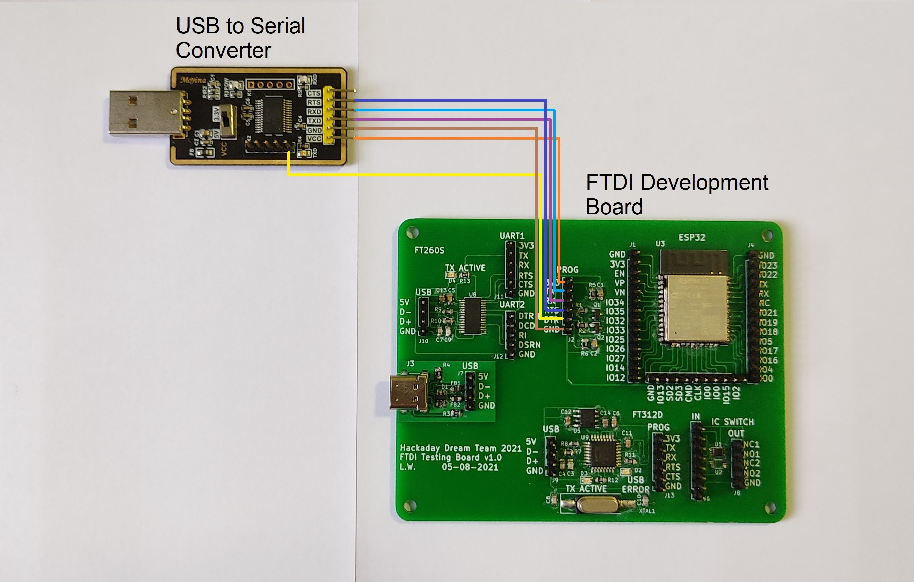
</p>

<p align="center">
  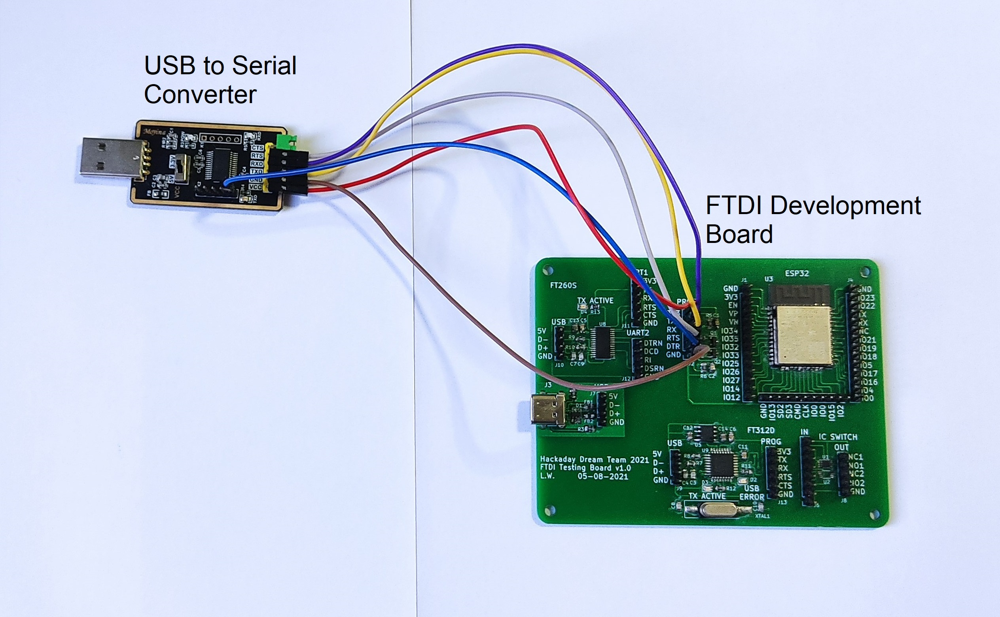
</p>

Once the 2 boards were connected and the [USB to Serial Converter](https://www.amazon.com/gp/product/B075N82CDL/ref=ppx_yo_dt_b_asin_title_o04_s00?ie=UTF8&language=en_US&psc=1) was plugged, the PC (in Windows) recognized the device and it was ready to use. Check if you need to install drivers associated to the FTDI, that is often the case.

Note: Before testing the following code, verify that the ESP-IDF is installed and the Arduino IDE can program ESP devices.

The code used is very simple, the ESP32 sends a "Hello world" message through the serial communication every second.

```
void setup() {
   Serial.begin(115200);
}

void loop() {
   Serial.println("Hello World");
   delay(1000);
}
```
To program the ESP32 we used the standard Arduino IDE, with the following configurations:

<p align="center">
  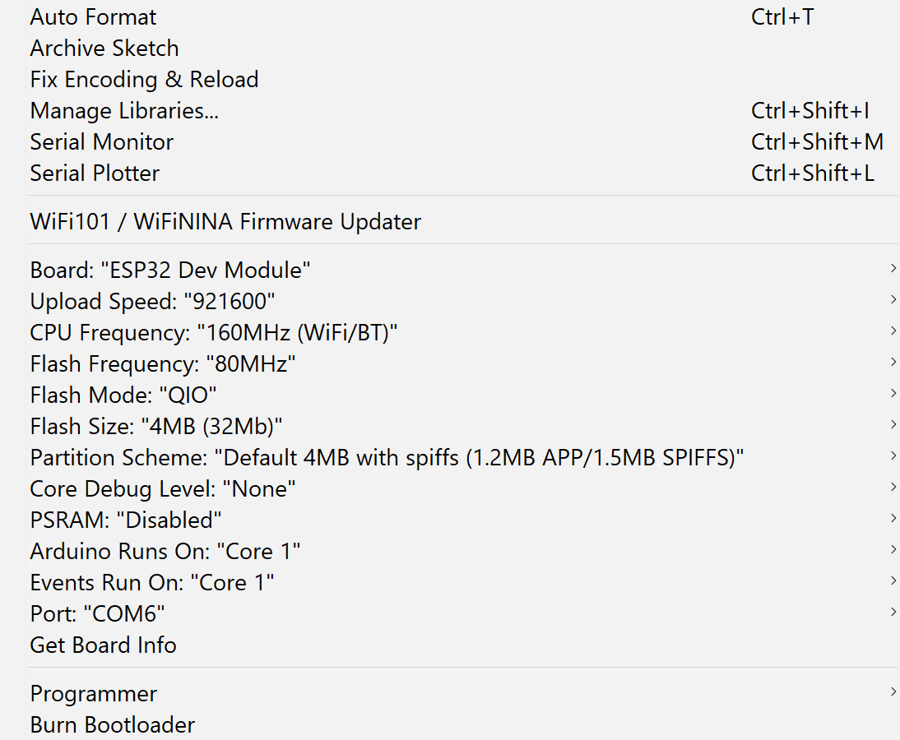
</p>

And the test was successful, the following image shows the results in the serial monitor.

<p align="center">
  
</p>
